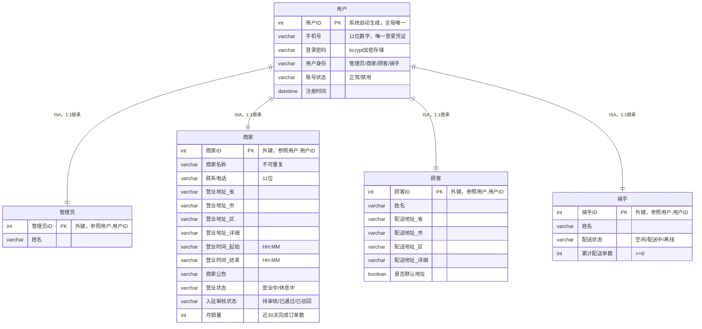
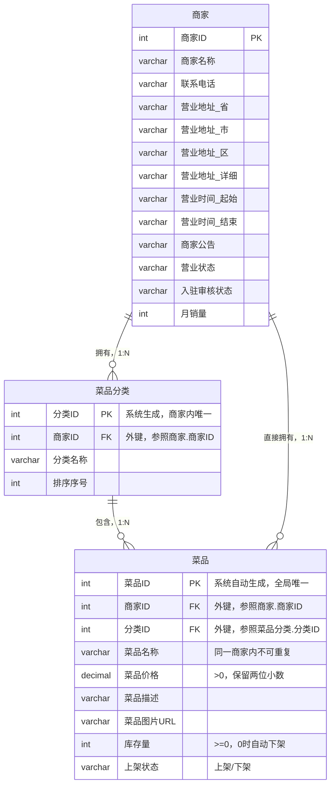
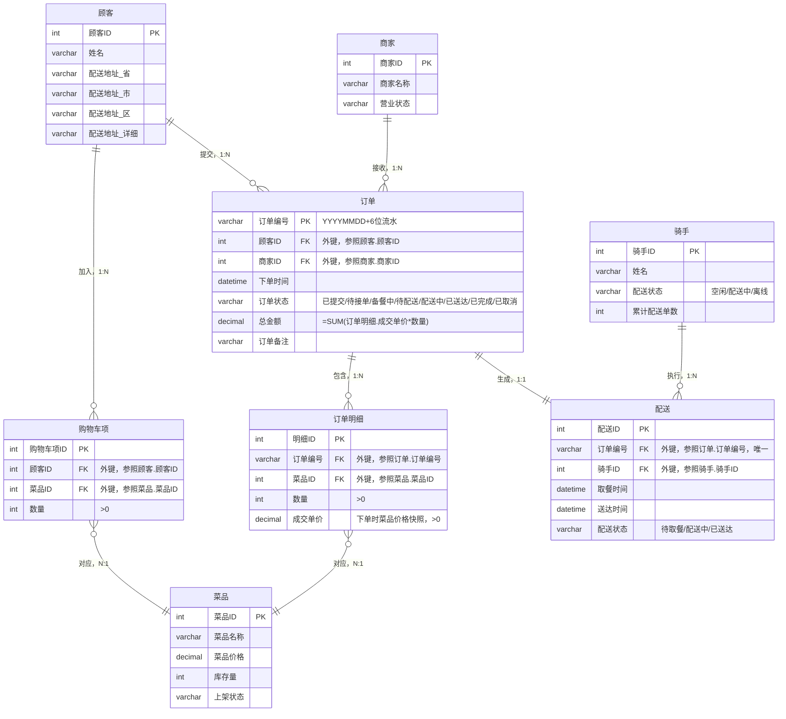
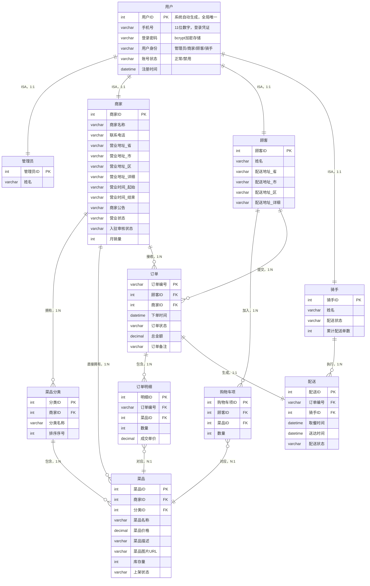
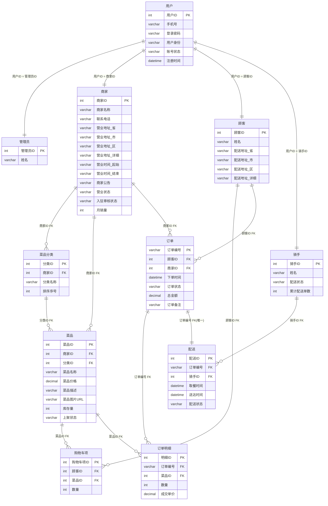

# 数据库课程概念&逻辑结构设计文档

---

**课题名称：** 外卖管理系统

**课题组员：** 王子谦  林净凯  丁陶俊

**完成时间：** 2026.05.16

---

## 第1部分 概念结构设计

### 1.1 设计概述

本部分基于《外卖管理系统系统需求分析》文档，采用**自顶向下、逐步分解**的方法进行概念结构设计。首先将系统分解为三个核心业务模块，分别设计局部 E-R 图，再通过整合与优化得到系统全局 E-R 图，清晰刻画系统中的实体、属性以及实体间的联系。

**设计步骤：**

1. 划分业务模块，确定每个模块涉及的实体
2. 设计各模块的局部 E-R 图（含实体、属性、联系及联系类型）
3. 消除冲突（属性冲突、命名冲突、结构冲突），合并为全局 E-R 图

**模块划分与分工：**

| 模块 | 涵盖范围 | 负责人 |
|------|----------|--------|
| 用户管理模块 | 四类用户（管理员/商家/顾客/骑手）的实体建模与继承关系 | （填写） |
| 商家与菜品管理模块 | 商家、菜品分类、菜品的从属关系与库存管理 | （填写） |
| 订单与配送管理模块 | 购物车、订单、订单明细、配送的全流程建模 | （填写） |
| 全局整合与优化 | 合并局部E-R图、消除冲突、统一规范 | （填写） |

---

### 1.2 局部 E-R 图设计

#### 1.2.1 用户管理模块局部 E-R 图

**涉及的实体：**

- **用户**（父实体）：存储所有类型用户的公共属性
- **管理员**（子实体）：平台运营方，特有属性为姓名
- **商家**（子实体）：入驻餐厅，特有属性包括商家名称、联系电话、营业地址、营业时间、公告、营业状态、入驻审核状态、月销量
- **顾客**（子实体）：消费者，特有属性包括姓名、配送地址（省/市/区/详细）
- **骑手**（子实体）：配送员，特有属性包括姓名、配送状态、累计配送单数

**设计要点：**

四种用户身份共享用户ID、手机号、登录密码、用户身份、账号状态、注册时间等公共属性。采用 **ISA（泛化/特化）继承关系**建模：用户为父实体，管理员/商家/顾客/骑手为子实体。子实体继承父实体的全部属性，各自扩展特有属性。这种设计避免了公共属性的重复存储，同时保持了各身份类型的独立性。

**局部 E-R 图：**



**联系说明：**

| 联系名 | 类型 | 参与实体 | 说明 |
|--------|------|----------|------|
| 用户-管理员 | 1:1 ISA | 用户 → 管理员 | 管理员是用户的一种身份特化，共享用户ID |
| 用户-商家 | 1:1 ISA | 用户 → 商家 | 商家是用户的一种身份特化，商家ID = 用户ID |
| 用户-顾客 | 1:1 ISA | 用户 → 顾客 | 顾客是用户的一种身份特化，顾客ID = 用户ID |
| 用户-骑手 | 1:1 ISA | 用户 → 骑手 | 骑手是用户的一种身份特化，骑手ID = 用户ID |

---

#### 1.2.2 商家与菜品管理模块局部 E-R 图

**涉及的实体：**

- **商家**（复用用户管理模块中定义的实体）
- **菜品分类**：每个商家自定义的菜品分组，如"主食""小吃""饮品"
- **菜品**：商家上架售卖的商品

**设计要点：**

- 一个商家可以创建**多个**菜品分类，每个分类**只属于**一个商家（1:N）
- 一个分类下包含**多个**菜品，每个菜品**只属于**一个分类（1:N）
- 菜品同时通过外键直接关联商家，便于快速检索商家下所有菜品（绕过分类）
- 菜品库存量由商家设置，下单时扣减；库存为0时自动下架
- 菜品价格快照机制：下单时在订单明细中存储成交单价

**局部 E-R 图：**



**联系说明：**

| 联系名 | 类型 | 参与实体 | 说明 |
|--------|------|----------|------|
| 商家-拥有-菜品分类 | 1:N | 商家 → 菜品分类 | 一个商家创建多个分类，一个分类只属于一个商家 |
| 菜品分类-包含-菜品 | 1:N | 菜品分类 → 菜品 | 一个分类下有多个菜品，一个菜品只属于一个分类 |
| 商家-直接拥有-菜品 | 1:N | 商家 → 菜品 | 冗余关联，用于跨分类检索某商家的全部菜品 |

> **说明：** 商家与菜品之间存在两条路径的关联：间接通过菜品分类（商家→分类→菜品），以及直接关联（商家→菜品）。直接关联属于受控冗余，目的是支持"查询某商家所有菜品（不区分分类）"的常见业务场景，避免每次都需要 JOIN 菜品分类表。

---

#### 1.2.3 订单与配送管理模块局部 E-R 图

**涉及的实体：**

- **顾客**（复用用户管理模块中定义的实体）
- **商家**（复用商家与菜品管理模块中定义的实体）
- **菜品**（复用商家与菜品管理模块中定义的实体）
- **购物车项**：顾客暂存的待下单菜品及数量
- **订单**：顾客提交的购买请求
- **订单明细**：订单中每条菜品的购买记录（含成交单价快照）
- **配送**：订单的配送任务记录
- **骑手**（复用用户管理模块中定义的实体）

**设计要点：**

- **购物车项**是顾客与菜品之间的联系实体，记录顾客暂存到购物车中的菜品和数量。顾客退出登录后购物车数据保留，待下次登录恢复
- **订单与菜品的 M:N 联系**通过**订单明细**拆分为两个 1:N 联系（订单→订单明细←菜品）
- **订单明细**存储成交单价快照：下单时将菜品当前价格写入成交单价，即使后续菜品调价，已完成订单的金额不受影响
- **订单与配送为一对一**：一笔订单对应一条配送记录
- **骑手与配送为一对多**：一个骑手可执行多次配送，但同一时间只能有一单"配送中"
- 订单状态流转：已提交 → 待接单 → 备餐中 → 待配送 → 配送中 → 已送达 → 已完成（取消操作可在"已提交"或"待接单"状态执行）

**局部 E-R 图：**



**联系说明：**

| 联系名 | 类型 | 参与实体 | 说明 |
|--------|------|----------|------|
| 顾客-加入-购物车项 | 1:N | 顾客 → 购物车项 | 一个顾客有多个购物车项，每个项对应一个菜品 |
| 购物车项-对应-菜品 | N:1 | 购物车项 → 菜品 | 每个购物车项指向一个菜品 |
| 顾客-提交-订单 | 1:N | 顾客 → 订单 | 一个顾客可提交多笔订单 |
| 商家-接收-订单 | 1:N | 商家 → 订单 | 一个商家接收多笔订单 |
| 订单-包含-订单明细 | 1:N | 订单 → 订单明细 | 一笔订单包含1条或多条明细 |
| 订单明细-对应-菜品 | N:1 | 订单明细 → 菜品 | 每条明细对应一个菜品 |
| 订单-生成-配送 | 1:1 | 订单 → 配送 | 一笔订单生成唯一一条配送任务 |
| 骑手-执行-配送 | 1:N | 骑手 → 配送 | 一个骑手可执行多条配送任务 |

---

### 1.3 全局 E-R 图设计

将上述三个局部 E-R 图进行整合，遵循以下原则：

1. **消除重复实体**：商家、顾客、菜品、骑手在多个模块中出现，全局图中只保留一份
2. **统一命名规范**：所有实体名称、属性名称保持一致
3. **合并关联关系**：将所有局部 E-R 图中的联系汇总到一张图中
4. **消除冗余联系**：如果两个实体之间已存在间接联系路径，评估是否保留直接联系

**整合后全局 E-R 图包含 11 个实体：**
用户、管理员、商家、顾客、骑手、菜品分类、菜品、购物车项、订单、订单明细、配送。

**全局 E-R 图：**



**全局 E-R 图联系汇总：**

| 序号 | 联系名 | 类型 | 参与实体 | 所在模块 |
|------|--------|------|----------|----------|
| R01 | ISA-管理员 | 1:1 | 用户 → 管理员 | 用户管理 |
| R02 | ISA-商家 | 1:1 | 用户 → 商家 | 用户管理 |
| R03 | ISA-顾客 | 1:1 | 用户 → 顾客 | 用户管理 |
| R04 | ISA-骑手 | 1:1 | 用户 → 骑手 | 用户管理 |
| R05 | 拥有 | 1:N | 商家 → 菜品分类 | 商家与菜品 |
| R06 | 包含 | 1:N | 菜品分类 → 菜品 | 商家与菜品 |
| R07 | 直接拥有 | 1:N | 商家 → 菜品 | 商家与菜品 |
| R08 | 加入 | 1:N | 顾客 → 购物车项 | 订单与配送 |
| R09 | 对应 | N:1 | 购物车项 → 菜品 | 订单与配送 |
| R10 | 提交 | 1:N | 顾客 → 订单 | 订单与配送 |
| R11 | 接收 | 1:N | 商家 → 订单 | 订单与配送 |
| R12 | 包含 | 1:N | 订单 → 订单明细 | 订单与配送 |
| R13 | 对应 | N:1 | 订单明细 → 菜品 | 订单与配送 |
| R14 | 生成 | 1:1 | 订单 → 配送 | 订单与配送 |
| R15 | 执行 | 1:N | 骑手 → 配送 | 订单与配送 |

---

## 第2部分 逻辑结构设计

### 2.1 初步关系模式设计

将全局 E-R 图的每个实体转换为一个关系（表），实体的属性对应关系的属性，实体的主键对应关系的主键。ISA 继承关系采用"父表 + 子表"方案实现：用户表存储公共属性，四个子表（管理员/商家/顾客/骑手）通过相同的主键值关联到用户表。

**初步关系模式（共 14 个关系）：**

| 编号 | 关系名 | 关系模式 |
|------|--------|----------|
| R1 | 用户 | **用户**(用户ID, 手机号, 登录密码, 用户身份, 账号状态, 注册时间) |
| R2 | 管理员 | **管理员**(管理员ID, 姓名) |
| R3 | 商家 | **商家**(商家ID, 商家名称, 联系电话, 营业地址-省, 营业地址-市, 营业地址-区, 营业地址-详细, 营业时间-起始, 营业时间-结束, 商家公告, 营业状态, 入驻审核状态, 月销量) |
| R4 | 顾客 | **顾客**(顾客ID, 姓名, 手机号, 默认配送地址ID) |
| R5 | 骑手 | **骑手**(骑手ID, 姓名, 配送状态, 累计配送单数) |
| R6 | 菜品分类 | **菜品分类**(分类ID, 商家ID, 分类名称, 排序序号) |
| R7 | 菜品 | **菜品**(菜品ID, 商家ID, 分类ID, 菜品名称, 菜品价格, 菜品描述, 菜品图片URL, 库存量, 上架状态) |
| R8 | 购物车项 | **购物车项**(购物车项ID, 顾客ID, 菜品ID, 数量) |
| R9 | 订单 | **订单**(订单编号, 顾客ID, 商家ID, 地址ID, 下单时间, 订单状态, 总金额, 订单备注) |
| R10 | 订单明细 | **订单明细**(明细ID, 订单编号, 菜品ID, 数量, 成交单价) |
| R11 | 配送 | **配送**(配送ID, 订单编号, 骑手ID, 取餐时间, 送达时间, 配送状态) |
| R12 | 配送地址 | **配送地址**(地址ID, 顾客ID, 省, 市, 区, 详细地址, 是否默认地址) |
| R13 | 通知 | **通知**(通知ID, 用户ID, 事件类型, 通知标题, 通知内容, 关联对象ID, 是否已读, 创建时间) |
| R14 | 操作日志 | **操作日志**(日志ID, 用户ID, 用户身份, 操作类型, 操作对象类型, 操作对象ID, 操作详情, 操作IP, 用户代理, 创建时间) |

> **说明**：带下划线者为该关系的主键。

---

### 2.2 模式优化

#### 2.2.1 外键约束定义

在初步关系模式的基础上，添加外键约束以保证数据的**参照完整性**。子表的主键同时也是外键（参照用户表的用户ID），这是实现 ISA 继承关系在关系数据库中的标准做法。

**添加外键后的关系模式：**

| 编号 | 关系名 | 关系模式（PK下划线，FK斜体标注） |
|------|--------|----------------------------------|
| R1 | 用户 | **用户**(<u>用户ID</u>, 手机号, 登录密码, 用户身份, 账号状态, 注册时间) |
| R2 | 管理员 | **管理员**(<u>*管理员ID*</u>, 姓名) <br>外键：管理员ID 参照 用户(用户ID) |
| R3 | 商家 | **商家**(<u>*商家ID*</u>, 商家名称, 联系电话, 营业地址-省, 营业地址-市, 营业地址-区, 营业地址-详细, 营业时间-起始, 营业时间-结束, 商家公告, 营业状态, 入驻审核状态, 月销量) <br>外键：商家ID 参照 用户(用户ID) |
| R4 | 顾客 | **顾客**(<u>*顾客ID*</u>, 姓名, 手机号, *默认配送地址ID*) <br>外键：顾客ID 参照 用户(用户ID)；默认配送地址ID 参照 配送地址(地址ID) |
| R5 | 骑手 | **骑手**(<u>*骑手ID*</u>, 姓名, 配送状态, 累计配送单数) <br>外键：骑手ID 参照 用户(用户ID) |
| R6 | 菜品分类 | **菜品分类**(<u>分类ID</u>, *商家ID*, 分类名称, 排序序号) <br>外键：商家ID 参照 商家(商家ID) |
| R7 | 菜品 | **菜品**(<u>菜品ID</u>, *商家ID*, *分类ID*, 菜品名称, 菜品价格, 菜品描述, 菜品图片URL, 库存量, 上架状态) <br>外键：商家ID 参照 商家(商家ID)；分类ID 参照 菜品分类(分类ID) |
| R8 | 购物车项 | **购物车项**(<u>购物车项ID</u>, *顾客ID*, *菜品ID*, 数量) <br>外键：顾客ID 参照 顾客(顾客ID)；菜品ID 参照 菜品(菜品ID) |
| R9 | 订单 | **订单**(<u>订单编号</u>, *顾客ID*, *商家ID*, *地址ID*, 下单时间, 订单状态, 总金额, 订单备注) <br>外键：顾客ID 参照 顾客(顾客ID)；商家ID 参照 商家(商家ID)；地址ID 参照 配送地址(地址ID) |
| R10 | 订单明细 | **订单明细**(<u>明细ID</u>, *订单编号*, *菜品ID*, 数量, 成交单价) <br>外键：订单编号 参照 订单(订单编号)；菜品ID 参照 菜品(菜品ID) |
| R11 | 配送 | **配送**(<u>配送ID</u>, *订单编号*, *骑手ID*, 取餐时间, 送达时间, 配送状态) <br>外键：订单编号 参照 订单(订单编号)；骑手ID 参照 骑手(骑手ID) |
| R12 | 配送地址 | **配送地址**(<u>地址ID</u>, *顾客ID*, 省, 市, 区, 详细地址, 是否默认地址) <br>外键：顾客ID 参照 顾客(顾客ID) |
| R13 | 通知 | **通知**(<u>通知ID</u>, *用户ID*, 事件类型, 通知标题, 通知内容, 关联对象ID, 是否已读, 创建时间) <br>外键：用户ID 参照 用户(用户ID) |
| R14 | 操作日志 | **操作日志**(<u>日志ID</u>, *用户ID*, 用户身份, 操作类型, 操作对象类型, 操作对象ID, 操作详情, 操作IP, 用户代理, 创建时间) <br>外键：用户ID 参照 用户(用户ID) |

#### 2.2.2 范式分析

对每个关系进行范式级别判断，确保至少达到 **3NF（第三范式）**，无传递函数依赖、无部分函数依赖。

| 关系 | 函数依赖分析 | 范式 |
|------|-------------|------|
| **用户** | 用户ID → {手机号, 登录密码, 账号状态, 注册时间}；手机号 → 用户ID；用户身份直接依赖于用户ID | BCNF |
| **管理员** | 管理员ID → 姓名；管理员ID = 用户ID，无其他依赖 | BCNF |
| **商家** | 商家ID → 所有属性；商家名称 → 商家ID；无传递依赖 | BCNF |
| **顾客** | 顾客ID → 所有属性；配送地址四属性无明显函数依赖（联合使用） | BCNF |
| **骑手** | 骑手ID → 所有属性；配送状态和累计配送单数都是直接依赖于骑手ID | BCNF |
| **菜品分类** | 分类ID → {分类名称, 排序序号, 商家ID}；无传递依赖 | BCNF |
| **菜品** | 菜品ID → 所有属性；菜品价格、库存等属性均只依赖于菜品ID，不依赖于商家ID或分类ID | BCNF |
| **购物车项** | 购物车项ID → {顾客ID, 菜品ID, 数量}；无部分依赖 | 3NF |
| **订单** | 订单编号 → 所有属性；总金额 = Σ(订单明细.成交单价×数量)，属于**派生属性**，受控冗余 | 3NF |
| **订单明细** | 明细ID → 所有属性；{订单编号, 菜品ID} → {数量, 成交单价} | BCNF |
| **配送** | 配送ID → 所有属性；订单编号 → 配送ID（一对一） | BCNF |
| **配送地址** | 地址ID → {顾客ID, 省, 市, 区, 详细地址, 是否默认地址}；无传递依赖 | BCNF |
| **通知** | 通知ID → 所有属性；无部分依赖，无传递依赖 | BCNF |
| **操作日志** | 日志ID → 所有属性；无部分依赖，无传递依赖 | BCNF |

> **关于订单.总金额的说明：** 总金额是派生属性（可由订单明细计算得出），此处采用受控冗余存储，原因如下：
> 1. 订单总金额是高频查询字段（订单列表展示、统计汇总），每次计算会带来不必要的 JOIN 开销
> 2. 订单一旦生成，明细不会变更，总金额不会出现不一致
> 3. 系统在写入订单明细时同步计算并写入总金额，应用层保证一致性

#### 2.2.3 受控冗余分析

以下字段属于有意引入的受控冗余，目的是以可接受的存储代价换取查询性能：

| 字段 | 所在关系 | 冗余来源 | 维护方式 |
|------|----------|----------|----------|
| 菜品.商家ID | 菜品(R7) | 可通过 菜品→菜品分类→商家 推导 | 写入时同步设置，分类变更时检查一致性 |
| 订单.总金额 | 订单(R9) | 可由 Σ(订单明细) 计算 | 创建订单明细时同步计算写入 |
| 商家.月销量 | 商家(R3) | 可由 COUNT(已完成订单) 计算 | 每日定时任务更新（非实时） |
| 订单明细.成交单价 | 订单明细(R10) | 可从菜品.菜品价格获取 | 下单时快照写入，后续菜品调价不影响 |
| 商家.自动接单 | 商家(R3) | 无（业务标志位） | 商家自行设置，下单时读取判断是否自动确认 |

---

### 2.3 数据库表关系图

基于优化后的关系模式，绘制外卖管理系统数据库表关系图，展示各表之间的主键-外键关联。



**表关系汇总：**

| 序号 | 关系 | 子表（外键侧） | 父表（被参照侧） | 类型 | 说明 |
|------|------|---------------|-----------------|------|------|
| FK01 | 管理员 → 用户 | 管理员(管理员ID) | 用户(用户ID) | 1:1 | ISA继承，共享主键 |
| FK02 | 商家 → 用户 | 商家(商家ID) | 用户(用户ID) | 1:1 | ISA继承，共享主键 |
| FK03 | 顾客 → 用户 | 顾客(顾客ID) | 用户(用户ID) | 1:1 | ISA继承，共享主键 |
| FK04 | 骑手 → 用户 | 骑手(骑手ID) | 用户(用户ID) | 1:1 | ISA继承，共享主键 |
| FK05 | 菜品分类 → 商家 | 菜品分类(商家ID) | 商家(商家ID) | N:1 | 分类归属商家 |
| FK06 | 菜品 → 商家 | 菜品(商家ID) | 商家(商家ID) | N:1 | 菜品归属商家 |
| FK07 | 菜品 → 菜品分类 | 菜品(分类ID) | 菜品分类(分类ID) | N:1 | 菜品归属分类 |
| FK08 | 购物车项 → 顾客 | 购物车项(顾客ID) | 顾客(顾客ID) | N:1 | 购物车项归属顾客 |
| FK09 | 购物车项 → 菜品 | 购物车项(菜品ID) | 菜品(菜品ID) | N:1 | 购物车项对应菜品 |
| FK10 | 订单 → 顾客 | 订单(顾客ID) | 顾客(顾客ID) | N:1 | 订单归属顾客 |
| FK11 | 订单 → 商家 | 订单(商家ID) | 商家(商家ID) | N:1 | 订单归属商家 |
| FK12 | 订单明细 → 订单 | 订单明细(订单编号) | 订单(订单编号) | N:1 | 明细归属订单 |
| FK13 | 订单明细 → 菜品 | 订单明细(菜品ID) | 菜品(菜品ID) | N:1 | 明细对应菜品 |
| FK14 | 配送 → 订单 | 配送(订单编号) | 订单(订单编号) | 1:1 | 配送关联订单 |
| FK15 | 配送 → 骑手 | 配送(骑手ID) | 骑手(骑手ID) | N:1 | 配送由骑手执行 |
| FK16 | 配送地址 → 顾客 | 配送地址(顾客ID) | 顾客(顾客ID) | N:1 | 地址归属顾客 |
| FK17 | 订单 → 配送地址 | 订单(地址ID) | 配送地址(地址ID) | N:1 | 订单使用配送地址 |
| FK18 | 通知 → 用户 | 通知(用户ID) | 用户(用户ID) | N:1 | 通知发送给用户 |
| FK19 | 操作日志 → 用户 | 操作日志(用户ID) | 用户(用户ID) | N:1 | 日志关联操作者 |

---

### 2.4 完整性约束汇总

除上述外键约束外，以下业务规则需通过 CHECK 约束或应用层逻辑实现：

| 类别 | 约束编号 | 约束说明 | 实现方式 |
|------|----------|----------|----------|
| 域约束 | DC01 | 菜品.菜品价格 > 0 | CHECK (菜品价格 > 0) |
| 域约束 | DC02 | 菜品.库存量 >= 0 | CHECK (库存量 >= 0) |
| 域约束 | DC03 | 订单明细.数量 > 0 | CHECK (数量 > 0) |
| 域约束 | DC04 | 订单明细.成交单价 > 0 | CHECK (成交单价 > 0) |
| 域约束 | DC05 | 购物车项.数量 > 0 | CHECK (数量 > 0) |
| 域约束 | DC06 | 用户.用户身份 IN ('管理员','商家','顾客','骑手') | CHECK |
| 域约束 | DC07 | 用户.账号状态 IN ('正常','禁用') | CHECK |
| 域约束 | DC08 | 商家.营业状态 IN ('营业中','休息中') | CHECK |
| 域约束 | DC09 | 商家.入驻审核状态 IN ('待审核','已通过','已驳回') | CHECK |
| 域约束 | DC10 | 骑手.配送状态 IN ('空闲','配送中','离线') | CHECK |
| 唯一约束 | UC01 | 用户.手机号 全局唯一 | UNIQUE INDEX |
| 唯一约束 | UC02 | 商家.商家名称 全局唯一 | UNIQUE INDEX |
| 唯一约束 | UC03 | 同商家中 菜品.菜品名称 唯一 | UNIQUE (商家ID, 菜品名称) |
| 业务规则 | BR01 | 总金额 = SUM(订单明细.成交单价 × 数量) | 应用层 / 触发器 |
| 业务规则 | BR02 | 骑手同一时间只能有一单"配送中" | 应用层判断 |
| 业务规则 | BR03 | 库存为0时自动下架 | 应用层 / 触发器 |
| 业务规则 | BR04 | 订单状态按固定路径流转 | 应用层状态机 |
| 域约束 | DC11 | 通知.事件类型 IN ('order_new','order_accepted','order_ready','delivery_accepted','delivery_arrived','merchant_audited') | CHECK |
| 域约束 | DC12 | 商家.自动接单 IN (0,1) | CHECK |
| 业务规则 | BR05 | 通知与 SSE 推送同步创建 | 应用层 |
| 业务规则 | BR06 | 操作日志通过 AOP 自动记录 | 应用层 |

---

## 附录A 图表索引

### A.1 图形索引

| 序号 | 图名 | 所在章节 | 生成文件 |
|------|------|----------|----------|
| 图1 | 用户管理模块局部E-R图 | 1.2.1 | `diagrams/01-用户管理模块局部ER图.png` |
| 图2 | 商家与菜品管理模块局部E-R图 | 1.2.2 | `diagrams/02-商家与菜品管理模块局部ER图.png` |
| 图3 | 订单与配送管理模块局部E-R图 | 1.2.3 | `diagrams/03-订单与配送管理模块局部ER图.png` |
| 图4 | 外卖管理系统全局E-R图 | 1.3 | `diagrams/04-全局ER图.png` |
| 图5 | 数据库表关系图 | 2.3 | `diagrams/05-数据库表关系图.png` |

### A.2 表格索引

| 序号 | 表名 | 所在章节 |
|------|------|----------|
| 表1 | 全局E-R图联系汇总 | 1.3 |
| 表2 | 初步关系模式 | 2.1 |
| 表3 | 范式分析 | 2.2.2 |
| 表4 | 受控冗余分析 | 2.2.3 |
| 表5 | 表关系汇总 | 2.3 |
| 表6 | 完整性约束汇总 | 2.4 |

### A.3 Mermaid 源文件

| 文件 | 对应图表 |
|------|----------|
| `diagrams/01-用户管理模块局部ER图.mmd` | 图1 |
| `diagrams/02-商家与菜品管理模块局部ER图.mmd` | 图2 |
| `diagrams/03-订单与配送管理模块局部ER图.mmd` | 图3 |
| `diagrams/04-全局ER图.mmd` | 图4 |
| `diagrams/05-数据库表关系图.mmd` | 图5 |

---

> **使用说明：**
>
> **方式一（推荐）：** 直接使用 `diagrams/` 目录下已生成的 PNG 图片，插入到 WPS/Word 文档对应章节即可。
>
> **方式二：** 复制本文档中的 Mermaid 代码块，粘贴到 [Mermaid Live Editor](https://mermaid.live) 中预览并导出 PNG/SVG，然后插入到 WPS/Word 文档。
>
> **方式三：** 若需要修改图表后重新生成，修改 `.mmd` 源文件后运行：
> ```bash
> cd diagrams && mmdc -i 文件名.mmd -o 文件名.png -b white -s 2
> ```
